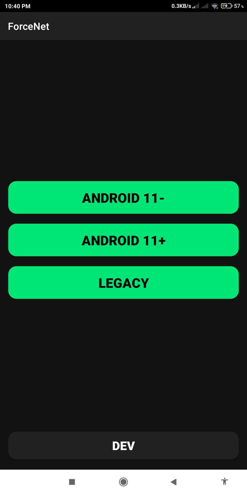

# 🛰️ ForceNet

<p align="center">
  
</p>

<p align="center">
  <b>A Lightweight, High-Performance Native Android Utility to Force Network Modes & Access Hidden RadioInfo.</b>
</p>

<p align="center">
  
  
  
</p>

---

### 📱 Preview

<p align="center">
  
</p>

---

### ⚡ Overview

**ForceNet** ek specialized, lightweight Android tool hai jo device ki hidden `RadioInfo` settings ko bypass karke direct open karta hai. Iski madad se aap cellular network ko specific modes (jaise **LTE Only**, **NR Only**) par lock kar sakte hain, jo normal settings me restricted hota hai.

Isko completely **Native Android Components (No AndroidX Dependency)** ke saath build kiya gaya hai, jisse yeh older compilers aur **Termux-based building environments** (jaise AIDE Lite, manual ecj/dx compilation) par bina kisi issue ya heavy dependency errors ke smooth compile aur run hota hai.

---

### 🚀 Key Features

* **Advanced Network Switching:** `RadioInfo` component ko trigger karke temporary ya permanent static network locking (4G/5G Only) activate karein.
* **Smart Intent Routing:** Android 11+ aur older versions dono ke liye automatic explicit/implicit intent fallback, jisse launch ke waqt custom ROMs ya heavy skins par app crash nahi hota.
* **Cyber-Green Minimalist UI:** Ek sleek, futuristic layout jisme neon accents, clean action rows aur compact buttons diye gaye hain.
* **Ultra Lightweight:** Zero third-party dependencies ya AndroidX overhead, perfect for low-spec devices aur standalone compiling.

---

### 🛠️ Technical Details & Compilation

Aap is project ko easily terminal ya mobile environments me compile kar sakte hain kyunki isme koi heavy Gradle architecture dependency nahi hai.

#### Manual Compilation via Termux (Sample Flow):
```bash
# 1. Compile Java Source files using ECJ
ecj -d bin -cp $ANDROID_JAR src/com/sr7mods/forcenet/*.java

# 2. Convert bytecode to Dalvik Executable (DEX)
dx --dex --output=classes.dex bin

# 3. Package and Sign the APK using apksigner
zip -r ForceNet.apk AndroidManifest.xml res classes.dex
apksigner sign --ks keystore.jks ForceNet.apk
```

---

### 📂 Repository Structure

* `src/` — Pure Native Java Implementation (Core Network Intent Handling Logic).
* `res/` — Cyber-Green Layout Resources aur drawables (Bina heavy themes ke).
* `icon.png` — Official high-resolution launcher icon.
* `ss.jpg` — Interface visual demonstration.

---

### 👑 Developer Credentials

<p align="center">
  <samp>
    <b>Dev:</b> SR7 Mods <br>
    <b>Contact & Links:</b> <a href="https://alexsifatrayhan.github.io/about-me/" target="_blank">alexsifatrayhan.github.io/about-me/</a>
  </samp>
</p>

<p align="center">
  
</p>
